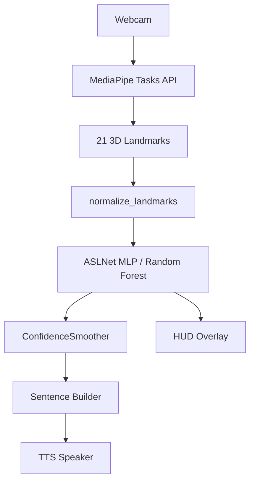

# SignScribe — ASL Alphabet Recognition System

<div align="center">
  <h3>🤟 Real-time American Sign Language Recognition using Machine Learning</h3>
  <p>A production-grade, modular ASL alphabet recognition system built on MediaPipe hand landmarks, a PyTorch MLP classifier, and a threaded Tkinter interface.</p>
</div>

---

## 📋 Table of Contents

- [Overview](#-overview)
- [Features](#-features)
- [Architecture](#-architecture)
- [Technologies](#-technologies)
- [Project Structure](#-project-structure)
- [Installation](#-installation)
- [Training](#-training)
- [Running the App](#-running-the-app)
- [How It Works](#-how-it-works)
- [Performance](#-performance)
- [Contributing](#-contributing)
- [License](#-license)

---

## 🎯 Overview

SignScribe is a real-time American Sign Language (ASL) alphabet recognition desktop application. It converts hand gestures into text using a landmark-based pipeline — processing 21 3D hand keypoints rather than raw pixels — for fast, lighting-robust predictions.

**Phase history:**
| Phase | Description |
|---|---|
| 1 | OpenCV HUD overlay, non-blocking TTS queue, production cleanup |
| 2 | `ConfidenceSmoother` — confidence threshold + streak + cooldown |
| 3 | Modular refactor — `core/` package separated from UI |
| 4 | PyTorch MLP replacing Random Forest, dual-backend inference |
| 5 | Background worker thread, bounded queue, UI poll loop |

---

## ✨ Features

- 🎯 **High Accuracy** — 95%+ on ASL A–Z + space/del/nothing
- ⚡ **Threaded Pipeline** — camera + detection + inference on background thread; UI stays responsive
- 🧠 **ConfidenceSmoother** — accepts only predictions with ≥80% confidence held for 3 consecutive frames, with 1.5s cooldown
- 🔊 **Offline TTS** — speaks completed words via `pyttsx3` queue worker
- 📺 **Live HUD** — letter, confidence bar, and FPS burned into the camera frame
- 🔌 **Dual-Backend Inference** — supports PyTorch `.pth` (MLP) and scikit-learn `.pkl` (Random Forest) via the same API
- 🧩 **Modular Codebase** — `core/` is fully independent of the UI

---

## 🏗 Architecture

```
┌──────────────────────────────────────────────────┐
│  _CameraWorker  (daemon thread)                  │
│                                                  │
│  cv2.VideoCapture → flip → MediaPipe detect      │
│    → draw landmarks → normalize_landmarks()      │
│    → SignLanguageModel.predict()                 │
│                    ↓                             │
│           Queue(maxsize=2)  FrameResult          │
└──────────────────────┬───────────────────────────┘
                       │  every 16 ms
┌──────────────────────▼───────────────────────────┐
│  Main Thread  (Tkinter)                          │
│                                                  │
│  _poll_results()                                 │
│    → drain queue (keep latest)                   │
│    → ConfidenceSmoother.add_prediction()         │
│    → update labels + HUD overlay                 │
│    → TTS on stable word                          │
└──────────────────────────────────────────────────┘
```



---

## 🛠 Technologies

| Category | Libraries |
|---|---|
| Hand Detection | MediaPipe Tasks API |
| ML Model | PyTorch (MLP), scikit-learn (Random Forest) |
| Computer Vision | OpenCV |
| GUI | Tkinter, ttkthemes, Pillow |
| TTS | pyttsx3 |
| Data | NumPy, Pandas |
| Threading | `threading`, `queue` |

---

## 📁 Project Structure

```
SignScribe-ASL-Detector/
│
├── core/                          ← Business logic (no UI dependency)
│   ├── __init__.py
│   ├── vision.py                  ← HandDetector + normalize_landmarks()
│   ├── inference.py               ← SignLanguageModel (.pkl and .pth)
│   ├── smoother.py                ← ConfidenceSmoother
│   └── tts.py                     ← speak() / shutdown()
│
├── ui/
│   ├── __init__.py
│   └── app.py                     ← Tkinter GUI + _CameraWorker thread
│
├── models/
│   ├── train_mlp.py               ← Train PyTorch MLP (Phase 4)
│   └── train_classifier.py        ← Train Random Forest (legacy)
│
├── utils/
│   ├── extract_landmark.py        ← Extract landmarks from image dataset → CSV
│   ├── data_prep.py               ← Legacy image data generators
│   └── evaluation.py              ← Model evaluation helpers
│
├── dataset/
│   ├── train/                     ← Training images (one folder per class)
│   │   ├── A/
│   │   ├── B/
│   │   └── ...
│   └── asl_landmarks.csv          ← Extracted landmark features (generated)
│
├── checkpoints/
│   ├── asl_mlp_model.pth          ← PyTorch MLP checkpoint (generated)
│   ├── hand_landmarker.task       ← MediaPipe Tasks API asset (auto-downloaded)
│   └── asl_landmark_model.pkl     ← Random Forest model (legacy)
│
├── results/                       ← Confusion matrix plots (generated)
├── main.py                        ← Legacy CNN/MobileNet entry point
└── README.md
```

### Legacy & Experimental Code

For historical context, the repository includes files from earlier image-classification and GUI approaches. The current working pipeline is landmark-based, making these older files obsolete:
- `main.py`, `ui/gui.py`, `ui/utils.py` (Old UI)
- `models/cnn_model.py`, `models/transfer_mobilenet.py`, `models/train_classifier.py` (Old models)
- `utils/data_prep.py`, `utils/evaluation.py` (Old dataset utils)

---

## 💻 Installation

### Prerequisites

- Python **3.10+**
- A working **webcam**
- Windows (pyttsx3 TTS requires `pywin32` on Windows; works on macOS/Linux too)

### 1. Clone the repository

```bash
git clone https://github.com/Kaivalya078/SignScribe_v2.git
cd signscribe/SignScribe-ASL-Detector
```

### 2. Create a virtual environment (recommended)

```bash
python -m venv .venv

# Windows
.venv\Scripts\activate

# macOS / Linux
source .venv/bin/activate
```

### 3. Install dependencies

```bash
pip install -r requirements.txt
```

> **Note:** If you have a CUDA GPU, install the CUDA build of PyTorch from [pytorch.org](https://pytorch.org/get-started/locally/) for faster training.

---

## 🏋 Training

Training is a two-step process: **extract landmarks** → **train model**.

### Step 1 — Prepare your dataset

Place your dataset image folders in the `dataset/` directory. The landmark extractor is configured to automatically scan the following default locations:

```text
dataset/
  asl_alphabet_train/         ← Primary Kaggle ASL Alphabet dataset
  kaggle/
    American/                 ← Additional Kaggle dataset 1
    Train_Alphabet/           ← Additional Kaggle dataset 2
```

> **Note:** The script will map common class aliases (e.g., `background` to `nothing`, `delete` to `del`) and intentionally ignore digit folders, as the current model targets only alphabet characters and special actions. See `DATASETS.md` for exact local setup details.

### Step 2 — Extract hand landmarks

Run from the **project root** (`SignScribe-ASL-Detector/`):

```bash
python utils/extract_landmark.py
```

This processes every image through MediaPipe, normalizes the 21 hand landmarks (wrist-relative + scale-invariant), and saves them to:

```
dataset/asl_landmarks.csv
```

Each row is `label, x0, y0, z0, x1, y1, z1, ..., x20, y20, z20` — 63 features.

**Expected output:**
```text
Starting landmark extraction from: dataset/asl_alphabet_train
Processing class: A
Processing class: B
...
Starting landmark extraction from: dataset/kaggle/American
...
Landmark extraction complete. Data saved to dataset/asl_landmarks.csv
```

### Step 3A — Train the MLP (recommended)

```bash
python models/train_mlp.py
```

**With custom options:**

```bash
python models/train_mlp.py \
  --csv    dataset/asl_landmarks.csv \
  --output checkpoints/asl_mlp_model.pth \
  --epochs 50 \
  --lr     0.001
```

| Argument | Default | Description |
|---|---|---|
| `--csv` | `dataset/asl_landmarks.csv` | Input landmark CSV |
| `--output` | `checkpoints/asl_mlp_model.pth` | Output checkpoint path |
| `--results` | `results/` | Directory for confusion matrix plot |
| `--epochs` | `50` | Training epochs |
| `--batch-size` | `64` | Batch size |
| `--lr` | `0.001` | Learning rate |

**Expected output:**
```
Loaded 87000 samples
Classes (29): ['A', 'B', ..., 'space']
Device: cpu

Epoch   1/50  loss=1.2341  val_acc=0.8123  lr=0.001000
Epoch   5/50  loss=0.4512  val_acc=0.9345  lr=0.001000
...
Epoch  50/50  loss=0.0891  val_acc=0.9612  lr=0.000500

Best validation accuracy: 0.9612
Model saved to checkpoints/asl_mlp_model.pth
Confusion matrix saved to results/confusion_matrix_mlp.png
```

### Step 3B — Train the Random Forest (legacy / fallback)

```bash
python models/train_classifier.py
```

Saves to `checkpoints/asl_landmark_model.pkl`.

> The app auto-detects which model to load based on file extension. MLP (`.pth`) is the default.

---

## 🚀 Running the App

Always run from the **project root** so that `core/` is importable as a package:

```bash
cd SignScribe-ASL-Detector
python -m ui.app
```

Or equivalently:

```bash
python -m ui.app
```

> ⚠️ Do **not** `cd` into `ui/` and run `python app.py` — the package imports will fail.

### What happens on startup

1. `SignLanguageModel` loads the checkpoint from `checkpoints/asl_mlp_model.pth`
2. The Tkinter window opens
3. Click **▶ Start Camera** — a background worker thread starts
4. The worker continuously reads frames, runs MediaPipe + MLP, and pushes results to the UI
5. The UI polls at 60 Hz and updates labels, overlay, and sentence

### Controls

| Control | Action |
|---|---|
| **▶ Start Camera** | Opens webcam, starts worker thread |
| **⏹ Stop Camera** | Signals worker to stop, joins thread |
| **Clear** | Empties the sentence |
| **Backspace** | Deletes the last character |

### Special signs

| Sign | Effect |
|---|---|
| `space` | Inserts a space; TTS speaks the last word |
| `del` | Triggers backspace |
| `nothing` | Ignored by the smoother |

### Tips for best recognition

- Good, even lighting — avoid harsh shadows on the hand
- Hold each sign still for ~0.5–1 second
- Keep the hand within the camera frame, palm facing the camera
- The confidence bar turns **green** above 85% — aim for that

---

## 📊 Performance

| Model | Accuracy | Inference | Size |
|---|---|---|---|
| **MLP (ASLNet)** | **~96%** | **< 5 ms** | **~200 KB** |
| Random Forest | ~95% | ~30 ms | ~2 MB |
| Legacy CNN | ~94% | ~65 ms | 45 MB |

**Smoother settings (defaults):**

| Parameter | Value | Effect |
|---|---|---|
| `confidence_threshold` | 0.80 | Minimum probability to count a frame |
| `stable_frames` | 3 | Consecutive frames required |
| `cooldown_seconds` | 1.5 | Lockout after each accepted letter |
| `max_streak_age` | 0.5 s | Debounce — streak must complete quickly |

---

## 🤝 Contributing

1. **Fork** the repository
2. **Create** a branch: `git checkout -b feature/my-feature`
3. **Commit**: `git commit -m 'Add my feature'`
4. **Push**: `git push origin feature/my-feature`
5. **Open** a Pull Request

Areas welcome:
- Extending to ASL words (Bi-LSTM on WLASL)
- Temperature scaling for better confidence calibration
- REST API wrapper around `core/inference.py`
- Mobile/web frontend


## 🙏 Acknowledgments

- Built upon the original [SignScribe-ASL-Detector](https://github.com/darshild078/SignScribe-ASL-Detector.git) repository
- **MediaPipe** team for the hand landmark solution
- **PyTorch** and **scikit-learn** communities
- ASL dataset contributors on Kaggle

---

<div align="center">
  <p><strong>⭐ Star this repo if it helped you!</strong></p>
  <p>Made with ❤️ for the ASL community</p>
</div>
